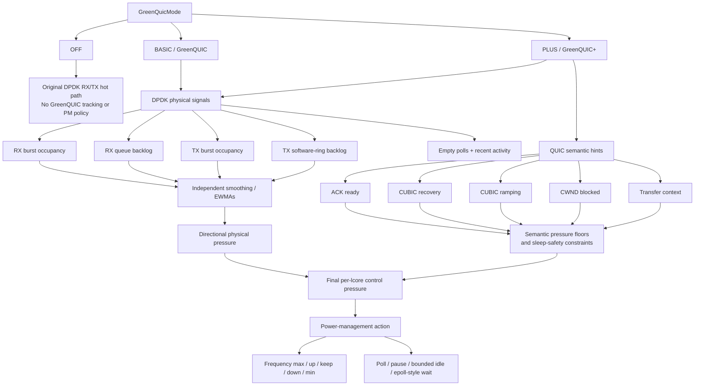
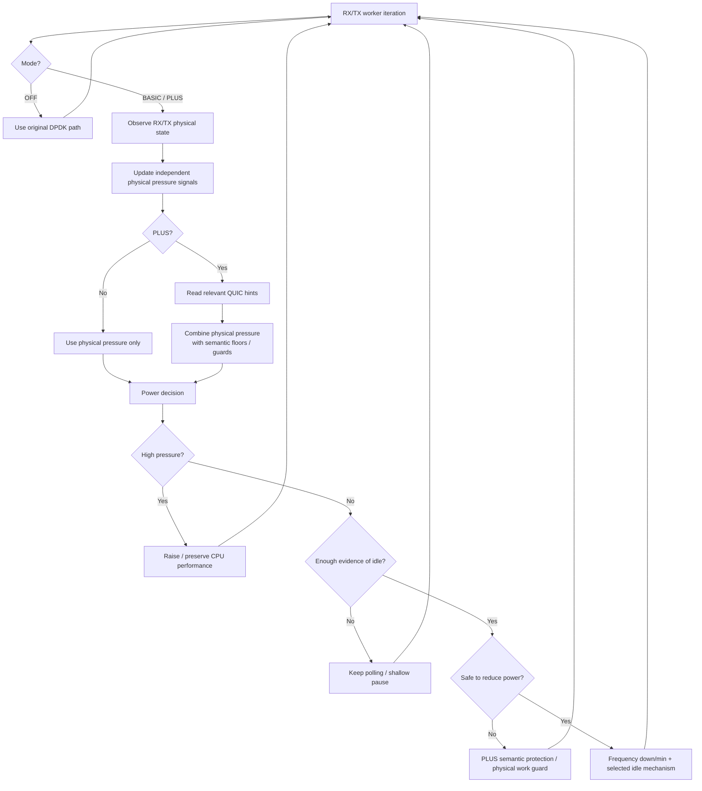

# GreenQUIC

**GreenQUIC is a research prototype for energy-aware CPU power management in DPDK-accelerated MsQuic.**

The repository explores a simple question:

> **How can a high-speed QUIC datapath reduce CPU energy use during low-demand periods without reacting too slowly when transport work becomes urgent again?**

GreenQUIC addresses this at two levels:

- **GreenQUIC (BASIC)** observes only physical DPDK datapath demand and adapts CPU frequency / idle behavior accordingly.
- **GreenQUIC+ (PLUS)** keeps the same physical policy, but adds short-lived QUIC semantic information so that the power manager can distinguish *truly idle* periods from moments where the datapath looks quiet but the transport still needs a responsive CPU.

`OFF`, `BASIC`, and `PLUS` are **three runtime behaviors of the same DPDK datapath**, not three separate protocol implementations.

---

## High-level overview

| Capability | OFF | BASIC / GreenQUIC | PLUS / GreenQUIC+ |
|---|:---:|:---:|:---:|
| Original DPDK RX/TX datapath | ✅ | ✅ | ✅ |
| GreenQUIC RX/TX tracking | ❌ | ✅ | ✅ |
| RX burst awareness | ❌ | ✅ | ✅ |
| RX NIC queue backlog awareness | ❌ | ✅ | ✅ |
| TX burst awareness | ❌ | ✅ | ✅ |
| TX software-ring backlog awareness | ❌ | ✅ | ✅ |
| Empty-poll / recent-activity tracking | ❌ | ✅ | ✅ |
| Separate smoothed physical signals | ❌ | ✅ | ✅ |
| Adaptive CPU-frequency control | ❌ | ✅ | ✅ |
| Adaptive idle / sleep policy | ❌ | ✅ | ✅ |
| ACK readiness awareness | ❌ | ❌ | ✅ |
| CUBIC recovery awareness | ❌ | ❌ | ✅ |
| CUBIC ramping awareness | ❌ | ❌ | ✅ |
| CWND-blocked awareness | ❌ | ❌ | ✅ |
| QUIC partition → DPDK-lcore locality | ❌ | ❌ | ✅ |
| QUIC hints can protect against premature sleep/downclock | ❌ | ❌ | ✅ |
| Main role | Baseline | Datapath-aware PM | Cross-layer QUIC-aware PM |

The central distinction is:

```text
OFF   = no GreenQUIC power decision

BASIC = when is the datapath physically busy or idle?

PLUS  = when is the datapath physically busy or idle?
        +
        when does QUIC need the CPU to remain responsive?
```

---

## Architecture



### The important design choice

**PLUS does not replace BASIC.** Physical DPDK measurements remain the foundation of the policy.

QUIC hints are applied *after* physical smoothing as short-lived semantic floors or safety constraints. This keeps the physical workload estimate independent from protocol hints and allows semantic protection to disappear quickly when the corresponding QUIC event is no longer relevant.

---

## What BASIC contributes

BASIC is the transport-independent GreenQUIC policy.

It asks:

> **How much CPU performance is justified by the work physically visible at the DPDK datapath right now and recently?**

BASIC observes both RX and TX independently. The physical workload signals include:

- current RX burst occupancy,
- RX NIC queue backlog,
- current TX burst occupancy,
- TX software-ring backlog,
- consecutive empty polls,
- recent RX/TX activity.

Instantaneous burst activity and persistent queue/ring backlog are intentionally kept as **separate signals with separate smoothing state**. A one-poll burst and a sustained backlog represent different kinds of demand and should not have identical persistence in the controller.

Conceptually:

```text
RX burst -----------┐
                    ├─> RX physical pressure ──┐
RX queue backlog ---┘                          │
                                               ├─> final physical pressure
TX burst -----------┐                          │
                    ├─> TX physical pressure ──┘
TX ring backlog ----┘
```

When pressure is high, GreenQUIC keeps or raises CPU performance. When pressure is low, it first confirms that the apparent idle period is persistent enough before reducing frequency or entering an idle mechanism.

The scientific role of BASIC is therefore:

> **Datapath-driven adaptive CPU power management using only observable packet-processing demand, without requiring transport-protocol knowledge.**

---

## What PLUS contributes

GreenQUIC+ extends BASIC with **cross-layer transport semantics**.

A DPDK queue can be empty even when QUIC is about to need CPU service. PLUS introduces lightweight hints from MsQuic so the power manager can protect these protocol-sensitive moments.

The current hint API includes:

- `ACK_PENDING` — an ACK is actually ready to be transmitted,
- `CUBIC_RECOVERY` — congestion recovery is active,
- `CUBIC_RAMPING` — the congestion window has grown,
- `CUBIC_CWND_BLOCKED` — the sender is congestion-window limited,
- transfer-context hints for server TX / client RX activity.

These hints are not treated as a replacement for real datapath demand. Instead they can:

- impose a temporary minimum control pressure,
- block or restrict aggressive sleeping,
- keep a relevant lcore responsive during transport-sensitive work,
- combine semantic urgency with physical evidence before selecting the most expensive CPU state.

This gives PLUS a different question to answer:

> **Is the datapath quiet because there is truly no useful work, or is it temporarily quiet while QUIC still needs fast CPU response?**

---

## Cross-layer locality

GreenQUIC+ associates transport information with the datapath through a configurable mapping:


This matters when multiple datapath lcores are used: a QUIC event associated with one partition should not unnecessarily increase the power state of unrelated datapath cores.

---

## Control loop

At a high level, the runtime policy is:



A simplified pseudocode view is:

```text
if mode == OFF:
    run original DPDK RX/TX path
else:
    observe RX/TX bursts, queue/ring backlog and idle history
    update independent physical pressure estimates

    if mode == PLUS:
        read local QUIC semantic hints
        apply temporary semantic pressure floors / sleep guards

    final_pressure = max(relevant RX and TX control pressure)

    if demand is high:
        raise or preserve CPU frequency
    elif demand is moderate:
        keep the CPU responsive
    else:
        confirm persistent idle
        reduce frequency when appropriate
        enter the configured bounded idle mechanism only when safe
```

---

## Three modes, three research roles

### OFF — baseline

OFF is the control condition. It keeps the original DPDK RX/TX hot path and disables GreenQUIC datapath tracking, DVFS decisions, idle policy, and runtime GreenQUIC+ hint processing.

Its purpose is to provide a clean reference against which the GreenQUIC policies can be evaluated.

### BASIC — GreenQUIC

BASIC introduces **datapath-aware power management** without QUIC semantics.

Its contribution is the separation of physical RX/TX demand into meaningful short-lived and persistent workload signals, followed by adaptive frequency and idle decisions based only on datapath evidence.

### PLUS — GreenQUIC+

PLUS introduces **cross-layer QUIC-aware power management**.

It preserves the BASIC datapath policy but adds transport urgency and locality. This allows the controller to be more conservative at protocol-sensitive moments while still exploiting genuine idle periods.

In short:

> **BASIC is reactive to physical packet-processing demand. PLUS is reactive to physical demand and additionally predictive/protective using QUIC transport state.**

---

## Key implementation locations

| Area | Main location |
|---|---|
| GreenQUIC datapath tracking, pressure calculation, DVFS and idle policy | `msquic/src/platform/datapath_raw_dpdk.c` |
| GreenQUIC+ hint API | `msquic/src/inc/greenquic_plus.h` |
| GreenQUIC+ hint storage/runtime mapping | `msquic/src/platform/greenquic_plus.c` |
| ACK-ready hook | `msquic/src/core/ack_tracker.c` |
| CUBIC recovery / ramping / blocked-state hooks | `msquic/src/core/cubic.c` |
| Current experiment suite | `greenquic_test_suite_v22/` |
| Main fresh-node bootstrap | `bootstrap_greenquic.sh` |
| TUM/LRZ testbed setup and recovery | `tum_testbed_setup/` |
| Historical one-off patches and debug artifacts | `patches/` |

The design intentionally keeps GreenQUIC logic concentrated in GreenQUIC/datapath code. QUIC core changes are kept to small semantic hooks that report transport state to the GreenQUIC+ layer.

---

## Runtime modes

The mode is selected at runtime through the GreenQUIC configuration:

```ini
GreenQuicMode=off
```

or

```ini
GreenQuicMode=basic
```

or

```ini
GreenQuicMode=plus
```

This makes it possible to evaluate the baseline, datapath-only policy, and cross-layer policy using the same underlying MsQuic/DPDK implementation.

---

## Test and measurement infrastructure

The repository also contains an experimental framework for repeatable client/server QUIC workloads and power/performance instrumentation. The current suite can collect and organize data such as:

- transfer timing and goodput,
- RAPL package / DRAM energy,
- CPU-frequency traces,
- Linux CPU-idle residency,
- GreenQUIC policy telemetry,
- client/server run metadata and validation artifacts.

Experimental results are intentionally **not** included in this README; the purpose of this page is to explain the implementation and research contribution.

---

## Testbed setup

For the TUM/LRZ IDEX + Tinyman environment, see:

```text
tum_testbed_setup/
```

That folder documents node allocation/reset through Coinbase and contains the Mac-side fresh-node setup script used to restore SSH, bootstrap dependencies, configure the E810/DPDK environment, prepare test assets, and validate the client/server path.

---

## Project scope

GreenQUIC is a **research prototype**, not a production power-management framework.

The controller decides when to request lower/higher CPU performance and when to attempt bounded idle mechanisms. It does **not** directly select a specific hardware C-state; Linux and the processor ultimately determine the concrete idle state reached.

The project is intended to study the tradeoff between:

```text
packet-processing responsiveness
            ↕
CPU power / energy efficiency
```

and, specifically, whether transport-aware information can make aggressive datapath power management safer for QUIC workloads.
